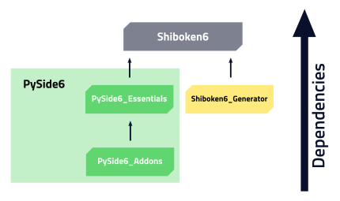
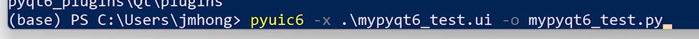

# 01 pyside6란?

Tkinter는 Python에 기본으로 내장되어서 제공되는 장점을 가지고 있지만, 개발의 용이성이나 확장성 측면에서 `PySide`와 `PyQt`가 훨씬 강력하다.

더욱이 매우 강력한 커뮤니티를 가지고 있으며 개발에 필요한 문서화가 잘되어 있다는 점이 Qt의 최대 장점이기 때문에, Python에서 GUI application을 개발하는 경우 `PySide` 와 `PyQt`는 매우 효과적인 도구이다.

* 공식 사이트 : https://doc.qt.io/qtforpython-6/

> 참고로, commercial application 개발에서는 `PySide6`가 라이센스 측면에서 보다 낫다. 해당 주제에 대해서는 다음 blog의 글을 먼저 읽어보길 권한다. [E: overload의 [Python\] PyQt와 PySide에 대한 잡설](https://dev-overload.tistory.com/44)


**[ 설치 방법 ]**

```python
pip install pyside6
```

- Generating a Python file from a `.ui` file: **`pyside6-uic -i form.ui -o ui_form.py`**
- Generating a Python file from a `.qrc` file: **`pyside6-rcc -i resources.qrc -o rc_resources.py`**
  - **pyside6-designer** 명령으로 *Qt 위젯 디자이너를* 열어 파일을 편집/생성합니다 .`.ui`


**[ QT의 장점 ]**

Qt의 최대 강점

- 거의 모든 platform을 지원 (cross platform)한다는 점
- Windows, macOS, Linux, Android 등에서 동작가능한 application을 하나의 코드로 개발가능하다.
  - Desktop application에 보통 해당된다.

이는 이상적인 애기이다.
실제로는 다른 플랫폼으로 porting을 할 경우, 어느정도의 소스코드 수정이 필요하다.

Desktop application의 경우엔 거의 수정이 필요치 않지만, 
모바일 쪽이나 embedded system쪽으로 타겟을 삼은 경우는 꽤 번거로운 수정이 동반되기 쉽다.

하지만 다른 framework에 비하면 정말 적은 량이라고 볼 수 있다.


**[ 라이센스 ]**

PySide가 개발되기 전 당시 Qt의 저작권을 갖고 있던 노키아가 RiverBank와 접촉해 GPL 라이선스인 PyQT를 LGPL로 변경해 줄 것을 요구했지만 이를 받아들이지 않아 개발된 것이 바로 PySide입니다.

즉 <u>PySide는 기본적으로 LGPL 라이선스가 보장됩니다.</u>
LGPL은 개발한 프로그램을 상업적으로 이용할 때는 GPL과 마찬가지로 라이브러리의 소스 코드를 공개해야 할 의무는 발생하지만, LGPL의 라이브러리를 링킹(linking)해 함께 동작하는 소스 코드는 따로 공개하지 않아도 됩니다. ( 링킹이란 라이브러리를 상업용 프로그램을 빌드 할 때 패키지에 포함하는 것을 말합니다. )

하지만 LGPL로 배포하는 라이브러리를 직접 수정 및 이를 기반한 새로운 라이브러리를 개발하는 경우에는 해당하는 소스 코드를 LGPL로 공개해야 한다는 차이가 있습니다.

따라서 상업적인 목적으로 개발할 경우 PySide를 이용하는 것이 조금 더 유리하겠습니다.


**[ 파일 타입 ]**

* 공식문서 : https://doc.qt.io/qtforpython-6/faq/typesoffiles.html

---

* Python Files : `.py`
* User Interface Definition File : `.ui`
* Resource Collection Files : `.qrc`
  * 애플리케이션과 함께 사용될 바이너리 파일 목록입니다. 
    XML 기반 파일로서 구조는 다음과 같습니다.
* Qt Modeling Language File : `.qml`
* Qt Creator Python Project File : `.pyproject`


**[ 패키지 종속성 ]**




6.3.0부터 pyside6 패키지(휠)는 거의 비어 있으며, 모든 모듈을 올바르게 사용하기 위해 필요한 다른 패키지에 대한 참조만 포함되어 있습니다. 이 패키지는 다음과 같습니다:

- `pyside6-essentials`, [필수 Qt 모듈](https://pypi.org/project/PySide6-Essentials/) ,
- `pyside6-addons`, [추가 Qt 모듈](https://pypi.org/project/PySide6-Addons/) ,
- `shiboken6`, 유틸리티 Python 모듈.

파이썬(가상) 환경에 설치된 패키지를 확인하기 위해 핍 리스트를 실행하여 이를 확인할 수 있습니다:

```
(env) % pip list
Package            Version
------------------ -------
pip                22.0.4
PySide6            6.3.0
PySide6-Addons     6.3.0
PySide6-Essentials 6.3.0
setuptools         58.1.0
shiboken6          6.3.0
```


----




QT desgineer에서 만든 ui 파일을 가져와서 python 코드로 전환하는 명령어


**PyQT**

* pyuic6 -x <ui_파일.ui> -o <python 파일명.py>

-----


**pyside6**

* pyside6-uic <ui_파일.ui> -o <python 파일명.py>