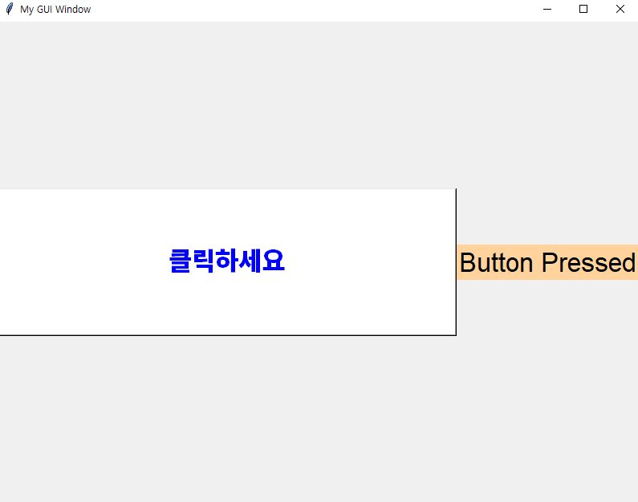
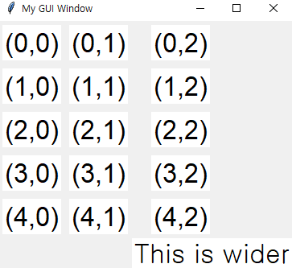

# GUI 프로그래밍

CLI(Command Line Interface) vs GUI(Graphical User Interface)


## TKinter 구성

**파이썬 표준 GUI 인터페이스 [TKinter](https://docs.python.org/3/library/tkinter.html)**

1. 윈도우(window) 생성
2. 프레임(frame) 추가 (선택)
   * 복잡한 일 을 할 때 나눠서 사용한다
3. 필요한 위젯들 추가
4. 배치 (geometry managers) 
   ( 우리말로 번역하면 기하구조 매니저 (geometry manager) )
5. 이벤트(콜백함수, 람다 등) 연결
6. 메인루프 시작


**위젯(Widgets)**

- 버튼(Button)
- 레이블(Label)
- 엔트리(Entry)
- 텍스트(Text)  

| 위젯        | 설명                                                         |
| ----------- | ------------------------------------------------------------ |
| Label       | 텍스트 혹은 이미지 표시                                      |
| Button      | 명령을 실행하기 위한 간단한 버튼                             |
| Entry       | 한 라인으로 된 단순한 텍스트 박스                            |
| ListBox     | 리스트 박스                                                  |
| Checkbutton | 값을 토글(toogle)하는 네모난 모양의 체크박스                 |
| Radiobutton | 다양한 옵션 중에서 하나를 선택하기 위한 동그란 버튼(들)      |
| Text        | 멀티 라인 텍스트 박스로서 일부 Rich Text 기능 제공           |
| Message     | Label과 비슷하게 텍스트 표시하나 Label과 달리 자동 래핑 기능이 있음 |
| Scale       | 슬라이스 바                                                  |
| Frame       | 다른 위젯들을 담기 위한 컨테이너 위젯으로 다른 위젯들을 그룹화할 때 사용 |
| Scrollbar   | 스크롤 바                                                    |
| Canvas      | 그래프와 점들로 그림을 그릴 수 있으며, 커스텀 위젯을 만드는데 사용하기도 함 |
| Menu        | 메뉴                                                         |
| Menubutton  | 메뉴 버튼                                                    |


**기하구조 매니저 (geometry manager)**

- pack
- place
- grid : 바둑판


### 사용법


**윈도우 생성 및 메인 루프 실행**

```py
from tkinter import *

# 루트 윈도우 생성
window = Tk()
window.title("My GUI Window")  # 윈도우 이름
window.geometry("800x600")  # 윈도우 크기

# 메인 루프 실행
window.mainloop()
```


**버튼 추가 (윈도우 -> 버튼)**

```py
from tkinter import *

window = Tk()
window.title("My GUI Window")  # 윈도우 이름
window.geometry("800x600")  # 윈도우 크기


def button_pressed():
    print("Button pressed")


# 버튼 만들기 (Master 설정 필요)
button = Button(
    master=window,
    text="클릭하세요",
    bg="white",
    fg="blue",
    width=80,
    height=5,
    command=button_pressed,  # 이벤트 연결
)

# 다양하게 설정 가능
button.pack(side=TOP)  # LEFT, RIGHT, TOP, BOTTOM

window.mainloop()
```


**윈도우 -> 프레임 -> 버튼**

```py
from tkinter import *

window = Tk()
window.title("My GUI Window")  # 윈도우 이름
window.geometry("800x600")  # 윈도우 크기

f = Frame(master=window, bg="plum1", bd=2)
# 프레임 배치
# f.pack()
f.place(x=100, y=250)

# 버튼 만들기
button = Button(
    f,
    text="클릭하세요",
    bg="white",
    fg="blue",
    width=80,
    height=2,
    command=lambda: print("Button pressed"),
)
button.pack(side=BOTTOM)  # LEFT, RIGHT, TOP, BOTTOM

window.mainloop()
```


**레이블 추가**

```py
from tkinter import *

window = Tk()
window.title("My GUI Window")  # 윈도우 이름
window.geometry("800x600")  # 윈도우 크기


def button_pressed():
    label["text"] = "Button Pressed"
    label["bg"] = "burlywood1"


label = Label(window, text="Hello!", font=("Arial", 25))

button = Button(
    master=window,
    text="클릭하세요",
    bg="white",
    fg="blue",
    width=80,
    height=5,
    font=("System", 25),
    command=button_pressed,
)

label.pack(side=RIGHT)
button.pack(side=RIGHT)

window.mainloop()
```




**grid() 배치**

```py
from tkinter import *

window = Tk()
window.title("My GUI Window")  # 윈도우 이름


for c in range(3):
    for r in range(5):
        new_label = Label(window, text=f"({r},{c})", font=("Arial", 25), bg="white")
        new_label.grid(row=r, column=c, padx=5, pady=5)

Label(window, text="This is wider", font=("Ariel", 25), bg="white").grid(
    row=5, column=2, columnspan=3
)

window.mainloop()
```




Entry 위젯으로 문자열 입력 받기. 이벤트 발생은 Button 사용

```py
from tkinter import *


def button_pressed():
    print(entry.get())							# entry로 문자열 가져오기
    entry.insert(index=END, string=", World!")  # entry로 문자열 삽입
    # entry.delete(0, END)						# entry에 문자열 삭제


window = Tk()

# justify - 입력한 문자열의 위치
entry = Entry(
    master=window, fg="black", bg="yellow", width=30, justify=CENTER, font=("Arial", 25)
)

button = Button(
    master=window,
    text="클릭하세요",
    bg="white",
    fg="blue",
    width=80,
    height=2,
    command=button_pressed,
)

entry.pack()
button.pack()

window.mainloop()
```


**Text 위젯으로 여러 줄**

index 방식 : 1.0의 의미는 1번째 줄의 0번 인덱스 부터 END 끝까지라는 의미이다.

(ex) text_box.get("1.0", END)

```py
window = Tk()


def button_pressed():
    print(text_box.get("1.0", END))
    text_box.insert(index="2.0", chars="Good!")
    #text_box.delete("1.0", END)


button = Button(
    master=window,
    text="클릭하세요",
    bg="white",
    fg="blue",
    width=80,
    height=2,
    command=button_pressed,
)
text_box = Text(master=window)

button.pack()
text_box.pack()

window.mainloop()
```


**`Frame` 프레임 여러개 사용 가능**

```py
from tkinter import *

window = Tk()

frame_a = Frame(master=window, relief=RAISED)
frame_b = Frame(master=window)

label_a = Button(master=frame_a, text="I'm in Frame A", font=("Arial", 25))
label_a.pack()

label_b = Label(master=frame_b, text="I'm in Frame B", font=("Arial", 25))
label_b.pack()

frame_a.pack()
frame_b.pack()

window.mainloop()
```

